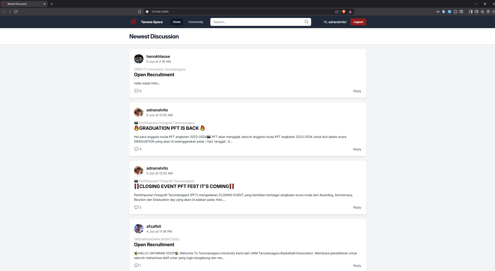

# 💬 T-Space

T-Space is a **simple online forum/message board** built using **Laravel**.  
The project serves as a communication platform for **Tarumanagara University students** to share ideas, discuss topics, and connect with one another.  

  
For full documentation including images and videos, you can visit my portfolio:  
[Click Me!](https://portfolio-adnanalvito.vercel.app/projects/4)

---

## ✨ Description

This application was developed as part of the **final project (UAS)** for the **Back-End Programming** course.  
In this course, I received the topic **"Simple Online Forum / Message Board"**, where I was required to design and implement a forum system using **Laravel**.  

As this project was created during my **second semester**, it mainly focuses on learning fundamental **back-end development concepts** such as:
- CRUD (Create, Read, Update, Delete) operations  
- MVC (Model–View–Controller) architecture    
- Database migration and seeding  
- Authentication and route protection  
- Blade templating for frontend rendering  

---

## 💡 Key Features

- 💬 Create and reply to discussion threads  
- 🔐 Basic user authentication (login/register)  
- ✏️ Users can manage their own posts and comments (create, edit, delete)  
- 👤 Profile management with photo upload stored in **local storage**  
- 🎨 Clean and responsive Blade-based frontend  


---

## 🧰 Tech Stack


---

## 🧠 What I Learned

Through developing **T-Space**, I learned the fundamentals of:
- Building RESTful applications with **Laravel**  
- Implementing **MVC (Model–View–Controller)** structure  
- Managing data with **Eloquent ORM** and **migrations**  
- Setting up **user authentication** and middleware  
- Designing simple yet consistent **frontend layouts using Blade and Tailwind CSS**  
- Connecting and structuring databases with **PostgreSQL**  

---

## 🚀 Getting Started

### 1️⃣ Clone the repository
```bash
git clone https://github.com/SiEncan/uas-backend-kelompok3.git
cd t-space
```

### 2️⃣ Install dependencies
```bash
composer install
npm install
```

### 3️⃣ Copy and configure environment variables
```bash
cp .env.example .env
php artisan key:generate
```

### 4️⃣ Run migrations
```bash
php artisan migrate
```

### 5️⃣ Start the development server
```bash
php artisan serve
```
